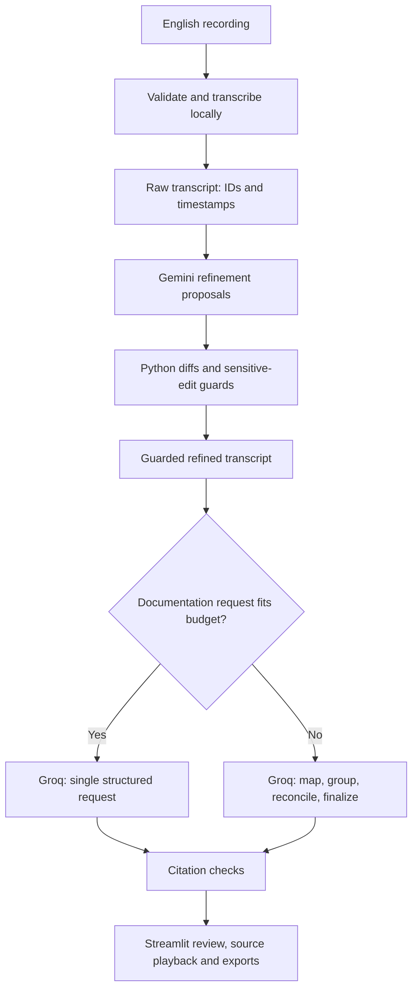

<div align="center">

# 🎙️ TraceMeet

### Meeting records you can inspect and trace to the recording.

**Local speech recognition · Guarded transcript refinement · Evidence-linked minutes**


**Inter IIT Bootcamp Project · IIT Guwahati · Aditya Om Sah**

[Get started](#quick-start-windows-powershell) · [How it works](#architecture) ·
[Technical description](docs/technical_description.md) · [Demo guide](docs/demo_checklist.md)

</div>

---

## What is TraceMeet?

TraceMeet turns recorded English meetings into readable transcripts and structured
meeting records. Upload a recording, follow the processing stages, inspect
corrections and minutes, then click a citation to hear the source passage.

The workflow retains **raw text, model proposals and guarded wording** so a
reviewer can see what changed before relying on a decision, task or deadline.
Results are readable directly in the app; JSON is available for integrations,
Markdown for portable notes, and CSV for spreadsheet workflows.

## Try it locally

| Entry point | Purpose |
|---|---|
| Streamlit application | Run locally after the setup below; normally opens at `http://localhost:8501` |
| [Sample recordings](samples/) | Upload a sample WAV and generate a new run |
| Saved runs | Reopen completed outputs and inspect their source recordings |
| [Demo checklist](docs/demo_checklist.md) | End-to-end recording guide; the final demo video link is pending |

No public hosted application URL is currently provided. Cloud language-model calls
still require your own configured API keys.

<details>
<summary><strong>Contents</strong></summary>

- [🎙️ TraceMeet](#️-tracemeet)
    - [Meeting records you can inspect and trace to the recording.](#meeting-records-you-can-inspect-and-trace-to-the-recording)
  - [What is TraceMeet?](#what-is-tracemeet)
  - [Try it locally](#try-it-locally)
  - [Why TraceMeet](#why-tracemeet)
  - [Architecture](#architecture)
  - [Three models, three roles](#three-models-three-roles)
  - [Technology stack](#technology-stack)
  - [Quick start: Windows PowerShell](#quick-start-windows-powershell)
    - [1. Prerequisites](#1-prerequisites)
    - [2. Clone and install](#2-clone-and-install)
    - [3. Configure keys](#3-configure-keys)
    - [4. Check configuration and model access](#4-check-configuration-and-model-access)
    - [5. Launch](#5-launch)
  - [Using TraceMeet](#using-tracemeet)
  - [Outputs and samples](#outputs-and-samples)
  - [Repository layout](#repository-layout)
  - [Tests and validation status](#tests-and-validation-status)
  - [Troubleshooting](#troubleshooting)
  - [Privacy and limitations](#privacy-and-limitations)
  - [Roadmap](#roadmap)
  - [Author and acknowledgments](#author-and-acknowledgments)
  - [📄 License](#-license)

</details>

---

## Why TraceMeet

A plausible meeting summary can still turn a suggestion into a decision, attach
an unstated deadline, or change a person's name. TraceMeet makes those risks
inspectable through separate model stages, correction logs, conservative edit
checks and citations linked to source audio.

| Capability | What you can inspect |
|---|---|
| Raw and refined transcripts | Stable segment IDs, timestamps and wording before/after refinement |
| Correction review | Raw wording, model proposal, applied wording, flags and reasons |
| Sensitive-edit guards | Number, negation, commitment, temporal, unit, currency and name-related heuristics |
| Structured meeting record | Decision statuses; confirmed/tentative tasks; nullable owners and deadlines |
| Source playback | Jump from a citation to its original recording segment |
| Saved-run recovery | Reuse matching completed stages after a failure or server restart |
| Long-meeting processing | Budgeted extraction, grouping, reconciliation and finalization checkpoints |
| Consistent downloads | UI and exports built from the same citation-checked record |

**Trust boundary:** citation checks establish that quoted text exists in a cited
segment. They do not verify that a claim follows from the quote. The summary is
uncited. Flagged refinement proposals retain the original wording; interactive
accept/reject/edit approval is not implemented.

## Architecture



Stable segment IDs link outputs back to transcript text and recording timestamps.
Input/configuration fingerprints and artifact hashes control reuse of completed
stages. Long-path substeps save checkpoints so an interrupted request need not
repeat all earlier work.

## Three models, three roles

| Stage | Configured model | Execution |
|---|---|---|
| Speech-to-text | Whisper `small.en` through faster-whisper; CPU `int8` | Local |
| Transcript refinement | `gemini-3.5-flash-lite` | Gemini API |
| Meeting documentation | `openai/gpt-oss-120b` | Groq API |

These are the configured IDs exercised during development, not a guarantee of
future provider availability. Check access with the live preflight. The current
integrated profile explicitly uses Gemini for refinement and Groq for documentation;
it does not automatically switch providers on failure.

The pipeline selects a single documentation request when the transcript fits the
configured budget, otherwise the checkpointed long path. Selection is based on
request size, not a fixed number of recording minutes.

## Technology stack

| Layer | Technology | Responsibility |
|---|---|---|
| Application | Python, Streamlit, pandas | Uploads, progress, review tables and downloads |
| Audio | PyAV, faster-whisper, CTranslate2 | Decode media and transcribe locally |
| Model interfaces | Google Gen AI SDK, HTTPX | Gemini refinement and Groq documentation |
| Contracts | Pydantic | Validate transcript and meeting-record structure |
| Configuration | PyYAML, python-dotenv | Model settings and environment-based secrets |
| Reliability | Python orchestration, hashes, checkpoints | Bounded recovery and saved-stage reuse |
| Traceability | difflib, exact citation matching | Correction spans and source references |
| Budgeting | tiktoken | Estimate request size before inference |
| Verification | pytest; jiwer available for evaluation | Regression tests and planned WER scoring |
| Persistence | Local run directories and JSON | Media, metadata and intermediate artifacts |

## Quick start: Windows PowerShell

### 1. Prerequisites

- Git and Python **3.11** available through the Windows Python launcher (`py`).
- Internet for package installation, initial speech-model/tokenizer downloads,
  and Gemini/Groq requests. No GPU is required for the default profile.
- A [Gemini API key](https://aistudio.google.com/apikey) and a
  [Groq API key](https://console.groq.com/keys), with access and quota for the models.

Cloud calls consume provider quota; free access and latency are not guaranteed.

### 2. Clone and install

```powershell
git clone https://github.com/adityaomsah/TraceMeet.git
cd TraceMeet
py -3.11 -m venv .venv
.\.venv\Scripts\python.exe -m pip install --upgrade pip
.\.venv\Scripts\python.exe -m pip install -r requirements.lock.txt
.\.venv\Scripts\python.exe -m pip check
```

The lock file records the developer's supplied environment snapshot, including
development and optional packages. A clean installation must still be verified
on the target machine. If a pinned distribution is unavailable, retain the error
and report it. `requirements.txt` provides a less constrained runtime installation
path, but resolving different versions is not exact environment reproduction.

Commands use the virtual environment's Python directly, so activation is optional.

### 3. Configure keys

Create `.env` in the repository root if it does not exist, then open it:

```powershell
if (-not (Test-Path .env)) {
    Set-Content -Path .env -Encoding utf8 -Value "GEMINI_API_KEY=`nGROQ_API_KEY="
}
notepad .env
```

Fill in these two values and save:

```dotenv
GEMINI_API_KEY=your_gemini_api_key
GROQ_API_KEY=your_groq_api_key
```

Keep `.env` out of Git. Never put keys in source code, screenshots or demo videos.
Model IDs and CPU settings live in [`config/default.yaml`](config/default.yaml).

### 4. Check configuration and model access

```powershell
# Configuration and key presence only; no network calls
.\.venv\Scripts\python.exe -m scripts.preflight_pipeline --offline

# One small live probe per language-model role; consumes quota
.\.venv\Scripts\python.exe -m scripts.preflight_pipeline
```

Use `preflight_pipeline` for this mixed-provider configuration. The older
Gemini-only preflight is a development tool, not the integrated setup check.
A successful probe confirms that a small request worked; it is not an accuracy test.

### 5. Launch

```powershell
.\.venv\Scripts\python.exe -m streamlit run app.py
```

Open the local URL printed in the terminal, normally `http://localhost:8501`.
Alternatively, after installation, use:

```powershell
powershell -ExecutionPolicy Bypass -File scripts\run.ps1
```

## Using TraceMeet

1. Upload an English audio/video recording. Supported upload extensions:
   WAV, MP3, M4A, FLAC, OGG, MP4, MOV, MKV and WEBM. Decodability still depends
   on the file; unsupported, empty and unreadable media produce errors.
2. Optionally supply names and technical terms, plus protected participant names.
   These are contextual hints, not evidence that a term was spoken.
3. Click **Process recording** once. Follow transcription, refinement, guard,
   documentation and citation-check status.
4. Inspect **Meeting record**, **Transcripts** and **Corrections**. For a held
   proposal, compare raw/proposed/applied wording. Click a citation timestamp
   and press Play in the sidebar; large recordings require playback opt-in.
5. Use **Downloads** for the export bundle. Transcript-only downloads remain
   available in run details even if documentation fails.
6. Open **Saved runs** to view previous outputs without inference calls. Use
   **Resume processing** for unfinished or invalidated stages; this can consume quota.

Run folders retain stable timestamp/UUID IDs. Display labels combine date, topic
and original filename. A custom display title does not change pipeline inputs.

The accepted upload size is controlled by `.streamlit/config.toml`; inspect your
checkout's setting. A large upload allowance does not guarantee unlimited meeting
length, low memory use or sufficient cloud quota. Start with a short recording.

## Outputs and samples

| Output | Purpose |
|---|---|
| Raw transcript JSON | Timestamped speech-model output |
| Guarded refined transcript JSON | Text actually passed to documentation |
| Correction/guard report | Proposed changes and applied/withheld status |
| Meeting record JSON | Summary, minutes, decisions, tasks and open questions |
| Meeting Markdown | Readable meeting notes |
| Task CSV | Spreadsheet-friendly action items |
| Evidence report | Citation results and limitations |
| ZIP | Export bundle; audio is not included |

Missing owners/deadlines remain `null` in structured data and appear as
**Unspecified** in readable views. Citation-valid values can still be semantically
wrong and require human inspection.

Sample audio is stored in [`samples/`](samples/). To test it, upload a sample WAV
through the app and generate a new run. A release sample must pair the exact audio
with its actual generated outputs and source/redistribution information. The demo
video and packaged sample-output bundle are pending final submission assembly;
see the [demo checklist](docs/demo_checklist.md).

## Repository layout

| Path | Responsibility |
|---|---|
| `app.py`, `pages/` | Upload workflow and saved-runs page |
| `tracemeet/audio/`, `tracemeet/stt/` | Structural media validation and local transcription |
| `tracemeet/schemas.py`, `tracemeet/config.py` | Data contracts and configuration |
| `tracemeet/llm/` | Provider adapters, request budgeting and retry utilities |
| `tracemeet/stages/` | Refinement and short/long documentation stages |
| `tracemeet/guards/` | Diffs, sensitive edits and citation checks |
| `tracemeet/pipeline.py` | Stage sequencing, artifact fingerprints and recovery |
| `tracemeet/ui/`, `tracemeet/export/` | Shared views, playback, labels and exports |
| `prompts/`, `config/` | Versioned instructions and model settings |
| `scripts/`, `tests/` | Development tools, preflights and automated tests |
| `eval/`, `samples/`, `docs/` | Evaluation tools, sample material and documentation |
| `runs/` | Local recordings, metadata and intermediate outputs; not source code |

## Tests and validation status

```powershell
.\.venv\Scripts\python.exe -m pip install -r requirements_dev.txt
.\.venv\Scripts\python.exe -m pytest tests -q
```

The latest explicitly recorded full-suite result before the display-label change
was **242 passed**. Additional label tests were supplied; rerun the suite for the
current checkout's count. Short live recordings completed the integrated workflow;
manual checks covered withheld edits, citation playback and ZIP exports. A long
463-segment recording completed the staged documentation workflow.

These checks demonstrate tested behavior, not meeting-understanding accuracy.
Annotated WER, decision/task precision and recall, harmful-edit analysis, a held-out
recording and the raw-versus-refined ablation remain pending. No accuracy score is
claimed. See [technical description](docs/technical_description.md).

## Troubleshooting

| Symptom | Next step |
|---|---|
| Missing key | Check root `.env`; run offline preflight. Viewing saved results needs no model call. |
| First transcription is slow | Allow the initial model download and CPU transcription to finish. |
| No audio/no speech | Check that the file contains a decodable audio track and audible English speech. Silence alone is not structural corruption. |
| 429/quota error | Check the provider's account limits and retry instructions. Preserve the run and resume when allowed. More attempts do not fix exhausted quota. |
| 503, timeout or connection failure | Preserve the run; check connectivity and retry later. A small preflight success does not guarantee a long request succeeds. |
| Long stages pause between calls | Quota pacing is deliberate. Run only one Groq workflow/CLI job at a time. |
| Token budget exceeded | Preserve checkpoints. Do not truncate the transcript or blindly raise the account budget. |
| Stale output warning | Input/config/artifact hashes no longer match; resume affected stages. Do not edit hashes to bypass the check. |
| Windows `WinError 5` replacing state | Stop processing, restart Streamlit and resume the saved run. A lock/permission cause is possible; persistent errors need investigation. |
| Run already processing | Do not start a second writer. If the server crashed, stop all writers before manually removing that run's `.processing.lock`. |
| Playback unavailable | Confirm original media remains in the run folder and matches metadata; browser codec support varies. |
| Port conflict | Add `--server.port 8502` to the Streamlit command. |

## Privacy and limitations

Audio is transcribed locally. Transcript text and supplied contextual terms are
sent to Gemini/Groq for the language stages. Recordings and intermediate artifacts
remain under `runs/`; this is not an encrypted or multi-user production storage
system. Review provider terms before using confidential recordings.

- English-only default; no speaker diarization or verified speaker attribution.
- Guards are heuristics: they may block useful edits and miss harmful ones.
- Exact citation matching does not verify entailment, task ownership or decision status.
- Long-meeting extraction/grouping can omit context despite structural coverage checks.
- Cloud output, availability, quotas and latency can vary. Matching checkpoints
  reproduce saved artifacts, not necessarily a new stochastic inference result.
- CPU runtime and browser memory increase with recording length.

## Roadmap

- [ ] Interactive accept / keep original / edit controls with an auditable review log.
- [ ] Tested local Ollama fallback and explicit provider-switch behavior.
- [ ] Annotated held-out evaluation and raw-versus-refined ablation.
- [ ] Larger speech-model and alternative refinement-model comparisons.

These are planned items, not claims about the current release.

## Author and acknowledgments

**[Aditya Om Sah](https://github.com/adityaomsah)** · IIT Guwahati

Built as a solo Inter IIT bootcamp project. Thanks to faster-whisper/CTranslate2,
PyAV, the Google Gen AI SDK, Groq, Pydantic, Streamlit and the Python ecosystem.
Third-party software and models retain their own licenses.

## 📄 License

MIT License — see [LICENSE](LICENSE) for details.

---

**Built at IIT Guwahati · Inspect the wording. Follow the evidence.**
